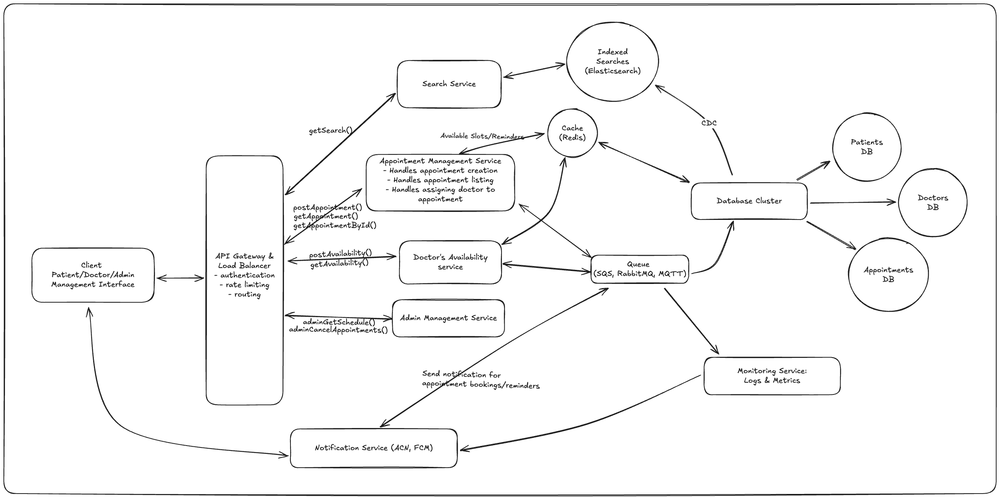

## System Design



### Overview

Based on the requirements, I have made a few assumptions and created a high-level design for the system. I have added the non-functional requirements and strategies for event-driven system. I have also calculated the high-level load and traffic for the system. Finally, I have listed the endpoints, database models, and the database schema for the system.

### Considerations

1. I have made the assumption that the system will be used by multiple clinics, and each clinic will have its own database. This means that the system will have to handle multiple databases and ensure data consistency across them.
2. I have also made the assumption that the system will be used by multiple users, and each user will have its own cache. This means that the system will have to handle multiple caches and ensure data consistency across them. Additionally, I have considered the cache invalidation strategy, which will depend on the database updates.
3. I have also made the assumption that the system will be used by multiple services, and each service will be connected to a centralized cache and database cluster. This means that the system will have to handle multiple connections and ensure data consistency across them.

### Functional Requirements

1. Patients should be able to see available appointment times and reserve that slot.
2. The system should internally assign an available doctor based on their schedule.
3. Doctors should have the ability to set their availability and view their assigned appointments.
4. The system should handle a large number of appointment requests and ensure low latency for scheduling.
5. The system should be fault-tolerant and capable of recovering from server crashes, network issues, or other technical problems.
6. Patients should receive appointment confirmations and reminders via email or notifications.
7. The system should provide an admin interface for clinic staff to manage doctor schedules and appointments.

### Non-Functional Requirements

1. **Scalability**: Must handle high traffic during peak times (e.g., flu season).
2. **Fault Tolerance**: Should recover gracefully from server crashes or network issues.
3. **Low Latency**: Appointment booking and doctor assignment should occur in under 500ms.
4. **Data Integrity**: Consistency is critical for appointment schedules and doctor availability.
5. **Security**: Use encryption for sensitive patient data and ensure role-based access control (RBAC).
6. **Availability**: Ensure 99.99% uptime through redundancy and failover strategies.
7. **Observability**: Log and monitor all critical actions and metrics to ensure system health.

### Strategies for Event-Driven System

1. **Asynchronous Processing**:

   - Used for message queues to decouple components and allow asynchronous communication.

2. **Event Streaming**:

   - Used for streaming platforms (e.g., Kafka) to enable real-time processing of updates such as availability changes.

3. **Idempotency**:

   - Ensures event handlers are idempotent to handle duplicate events safely.

4. **Backpressure Management**:

   - Introduces rate-limiting and buffering in case of high event inflow.

5. **Event Sourcing**:

   - Maintain an event store for reconstructing the state of the system in case of failures.

6. **Monitoring and Alerting**:

   - Track event delivery and processing metrics, and set alerts for failures or delays.

7. **Fallbacks and Circuit Breakers**:
   - Implement circuit breakers for dependent services to avoid cascading failures.

### High-Level Load and Traffic Calculations

1. **Users and Requests**:

   - Target Clinics: 100.
   - Active Users per Clinic: 10,000.
   - Peak Concurrent Users: 20% (200,000 users system-wide).
   - Requests per Interaction: 2 (e.g., viewing slots and booking).

2. **Peak Traffic**:

   - Total Appointment-Related Requests: 400,000/hour.

3. **Notifications**:

   - Confirmation and Reminders: ~300,000 messages/day.

4. **Doctor Availability Updates**:

   - Updates by ~500 doctors per clinic daily: 50,000 updates total.

5. **Scaling Strategy**:
   - Auto-scale backend services and cache frequent queries to handle peak traffic.
   - Design databases to handle up to 500,000 read/write queries per hour at peak.

### Endpoints

#### Patient Endpoints

1. **GET /appointments/slots** - Fetch available slots.
2. **POST /appointments/book** - Book an appointment.
3. **GET /appointments/{id}** - View appointment details.
4. **DELETE /appointments/{id}** - Cancel an appointment.

#### Doctor Endpoints

1. **POST /doctors/availability** - Set availability.
2. **GET /doctors/appointments** - View assigned appointments.

#### Admin Endpoints

1. **GET /admin/appointments** - View/manage all appointments.
2. **POST /admin/appointments/override** - Override or create appointments.
3. **GET /admin/doctors** - View/manage doctor schedules.

#### Notification Endpoints

1. **POST /notifications/send** - Send notifications.

#### Auth Endpoints

1. **POST /auth/login** - Login.
2. **POST /auth/register** - Register.

### Database Models

#### Patients

```json
{
  "id": "UUID",
  "name": "string",
  "email": "string",
  "phone": "string",
  "createdAt": "date",
  "updatedAt": "date"
}
```

#### Doctors

```json
{
  "id": "UUID",
  "name": "string",
  "specialization": "string",
  "availability": [
    {
      "day": "string",
      "start": "date",
      "end": "date"
    }
  ],
  "createdAt": "date",
  "updatedAt": "date"
}
```

#### Appointments

```json
{
  "id": "UUID",
  "patientId": "UUID",
  "doctorId": "UUID",
  "startTime": "date",
  "endTime": "date",
  "status": "string", // e.g., "Scheduled", "Cancelled"
  "createdAt": "date",
  "updatedAt": "date"
}
```

#### Notifications

```json
{
  "id": "UUID",
  "recipient": "string",
  "type": "string", // e.g., "Email", "SMS"
  "content": "string",
  "status": "string", // e.g., "Sent", "Failed"
  "createdAt": "date",
  "updatedAt": "date"
}
```

### Some Important Explanations

1. As you can see, the services are connected to cache first and then the database cluster. That's because the cache is a fast and reliable storage for frequently accessed data, while the database cluster is a scalable and fault-tolerant storage for less frequently accessed data. Also, the cache serves as a unified layer between the database and services, ensuring all services read/write through a consistent caching layer. Changes to the database (e.g., availability updates) propagate to the cache, maintaining synchronized states across all services.Services access the cache for frequently needed data (e.g., available slots), and cache invalidation happens based on database updates, ensuring reliability. And last but not least, having cache directly reflect database queries avoids custom caching strategies in each service.

2. We are using CDC (Change Data Capture) to capture database changes and propagate them to Elasticsearch. This allows us to search and analyze the data in real-time, providing valuable insights and improving the overall system performance. The CDC process involves capturing changes to the database, converting them into JSON documents, and sending them to Elasticsearch. Elasticsearch then indexes the documents and provides fast and efficient search capabilities. This approach ensures that the system can handle large amounts of data and provide timely insights.

3. Since the assumption is that the system will be used by multiple clinics, it could also be in multiple regions. To handle this, a CDN can be used between the client and the server to distribute the load. This will sit between the client and the API gateway, ensuring that the data is cached closer to the user, reducing latency and improving performance.

4. Although there was no need to specify monitoring and alerting, I have included it in the system design. Monitoring and alerting are crucial for maintaining the health and availability of the system. By monitoring the system, we can detect and respond to issues in real-time, ensuring the system remains operational and reliable. Alerting allows us to notify the relevant parties about any issues or anomalies, providing timely and effective response. Also, it is necessary for notifications to be sent to the users, ensuring they are aware of any changes or updates.
